# Job Flow — full graph with split boundaries

Complete Mermaid graph of the system: every step, decision, observation, standing
invariant, orchestrator contract, and the **split seams** (from SPLITS.md) —
checkpoint gates, read/write direction, and the fill/verify split. Render in any
Mermaid-capable viewer or re-render with:

    npx -y @mermaid-js/mermaid-cli -i FLOW_GRAPH.md -o FLOW_GRAPH.png

Legend:
- `▣` step · `◆` decision · `◎` observation · `▼` **checkpoint gate** (hard stop; waits on a C-contract)
- red outline = **hard no** (deterministic / fail-closed / one-shot; orchestrator excluded)
- yellow = orchestrator **core** · pale yellow = orchestrator **fallback** · purple = orchestrator contract
- solid thin = flow · thick = checkpoint stop · dashed = write to trail · dotted = read from trail

```mermaid
flowchart LR
    %% ================= STAGE 1-2: INTAKE =================
    subgraph INT["1-2 INTAKE"]
        direction TB
        P1["▣ message arrives"]
        P2["▣ screened as job lead"]
        P3["▣ destination pulled out"]
        P4["▣ destination judged safe<br/><b>hard no</b>"]
        P5["▣ prior-knowledge check"]
        P6["◆ category"]
        P7["◆ accept / set-aside / flag"]
    end
    P1 ---> P2 ---> P3 ---> P4 ---> P5 ---> P6 ---> P7

    %% ================= STAGE 3: ENRICH =================
    subgraph ENR["3 ENRICH"]
        direction TB
        P8["▣ posting fetched"]
        P9["◆ sign-in barrier?"]
        P10["▣ content to description"]
        P11["◆ facts pulled"]
        P12["◆ near-duplicate?"]
        P13["◆ fit review"]
        P14["▣ described / set aside"]
    end
    P7 ==> CKPT_C1["▼ CKPT C1<br/>fit verdict<br/><b>hard stop</b>"]
    CKPT_C1 ---> P8 ---> P9 ---> P10 ---> P11 ---> P12 ---> P13
    P13 ==> CKPT_C1
    P13 ---> P14

    %% ================= STAGE 4: GENERATE =================
    subgraph GEN["4 GENERATE"]
        direction TB
        P15["▣ tailored draft"]
        P16["◎ claims traced to record<br/><b>hard no</b>"]
        P17["◆ unfounded claims resolved"]
        P18["▣ draft to documents"]
        P19["▣ ready to apply"]
    end
    P14 ==> CKPT_C3["▼ CKPT C3<br/>grounding<br/><b>hard stop</b>"]
    CKPT_C3 ---> P15 ---> P16 ---> P17
    P17 ==> CKPT_C3
    P17 ---> P18 ---> P19

    %% ================= STAGE 5: APPLY =================
    subgraph APP["5 APPLY"]
        direction TB
        P20["▣ entry point located"]
        P21["◆ flow kind"]
        P22["▣ journey to form"]
        P23["▣ fields listed"]
        P24["◆ fields given meaning"]
        P25["▣ answer from record"]
        P26["▣ learned answer"]
        P27["▣ safe default<br/><b>hard no</b>"]
        P28["◆ unanswered to decision"]
        P29["▣ answer entered"]
        P30["◎ value read back"]
        P31["◆ read-back compared"]
        P32["◎ verified / unverified<br/><b>hard no</b>"]
        P33["◆ sensitive unverified escalated"]
        P34["◆ cross-field contradictions"]
        P35["▣ form summarised"]
        P36["◆ submit decision (human policy)"]
        P37["▣ submit performed<br/><b>hard no</b>"]
        P38["◎ outcome observed"]
        P39["◆ uncertain outcome investigated"]
        P40["▣ marked applied"]
    end
    P19 ---> P20 ---> P21 ---> P22 ---> P23
    P23 ==> CKPT_C2["▼ CKPT C2<br/>field meaning + answer<br/><b>hard stop per label</b>"]
    CKPT_C2 ---> P24 ---> P25 ---> P26 ---> P27 ---> P28
    P28 ==> CKPT_C2
    %% fill/verify seam: P29 = resolve-and-enter (mutates), P30-32 = observe+stamp (certifies)
    P28 ---> P29
    P29 ===== P30
    P30 ---> P31 ---> P32 ---> P33 ---> P34 ---> P35
    P35 ---> P36 ---> P37
    P37 ==> CKPT_C4["▼ CKPT C4<br/>outcome verdict<br/><b>hard stop</b>"]
    CKPT_C4 ---> P38 ---> P39
    P39 ==> CKPT_C4
    P39 ---> P40

    %% multi-part advance loop: fill → next part → fill again → review
    P29 ---> P49
    P49 ---> P29
    P49 ---> P36

    %% ================= STAGE 6: OUTREACH =================
    subgraph OUT["6 OUTREACH"]
        direction TB
        P41["▣ people discovered"]
        P42["▣ prior-outreach check<br/><b>hard no</b>"]
        P43["◆ contact chosen"]
        P44["▣ message written"]
        P45["▣ message sent<br/><b>hard no</b>"]
        P46["◎ unconfirmed send verified"]
    end
    P40 -. parallel .-> P41
    P41 ---> P42
    P42 ==> CKPT_C5["▼ CKPT C5<br/>contact + message<br/><b>hard stop</b>"]
    CKPT_C5 ---> P43 ---> P44
    P44 ==> CKPT_C5
    P44 ---> P45 ---> P46

    %% ================= CROSS-CUTTING =================
    subgraph X["CROSS-CUTTING"]
        direction TB
        P47["▣ readiness check"]
        P48["▣ documents attached"]
        P49["▣ multi-part advance"]
        P50["▣ answer learned"]
        P51["▣ regression vs previous"]
        P52["▣ outreach facts traced<br/><b>hard no</b>"]
        P53["▣ failed step retried"]
        P54["▣ set-asides re-examined"]
    end
    P47 ---> P19
    P19 ---> P48
    P48 ---> P20
    P50 -. feeds .-> P26
    P51 ---> P36
    P54 -. re-check .-> P9
    %% retry loop: any failing step → retry → back to the step
    P8 -. fail .-> P53
    P15 -. fail .-> P53
    P29 -. fail .-> P53
    P53 -. retry .-> P8
    P53 -. retry .-> P15
    P53 -. retry .-> P29
    %% undo / archive loops
    P14 -. undo → reclassify .-> P7
    P40 -. undo .-> P19
    P40 -. archive .-> L5
    P14 -. archive .-> L5

    %% ================= STANDING =================
    subgraph STD["STANDING invariants"]
        direction TB
        L1["L1 decision inbox"]
        L2["L2 evidence trail<br/>(write-only from steps)"]
        L3["L3 one-shot guard<br/><b>hard no</b>"]
        L4["L4 state persistence"]
        L5["L5 archival"]
        L6["L6 practice mode"]
    end
    P28 -. write .-> L1
    %% write arrows: steps → L2 (unidirectional, write-only)
    P16 -. write .-> L2
    P30 -. write .-> L2
    P38 -. write .-> L2
    P37 -. gated by .-> L3
    P45 -. gated by .-> L3
    P19 -. persisted .-> L4

    %% ================= ORCHESTRATOR =================
    subgraph ORC["ORCHESTRATOR (read-only views + contracts)"]
        direction TB
        C1["C1 fit verdict<br/>ADMIT / REJECT"]
        C2["C2 answer resolution<br/>ANSWER → learning"]
        C3["C3 grounding<br/>FACT / FIX / FORCE"]
        C4["C4 outcome verdict<br/>SUBMITTED / FAILED / UNCERTAIN"]
        C5["C5 contact + message<br/>DRAFT"]
        C6["C6 vision confirm<br/>YES / NO / CANNOT"]
        C7["C7 fleet decision<br/>FIX / ANSWER / HANDOVER"]
        C8["C8 adjudication<br/>VERDICT wrong → fix"]
        C9["C9 escalation question<br/>QUESTION owner"]
        S1["S1 decision inbox"]
        S2["S2 dossier"]
        S3["S3 fit queue"]
        S4["S4 fleet report"]
        S5["S5 outcome evidence"]
        S6["S6 readiness"]
        S7["S7 adjudication ledger"]
        S8["S8 session timeline"]
    end
    CKPT_C1 --- C1
    C1 --- S3
    CKPT_C2 --- C2
    C2 --- S1
    CKPT_C3 --- C3
    CKPT_C4 --- C4
    C4 --- S5
    CKPT_C5 --- C5
    P31 --- C6
    C6 --- S2
    C7 --- S4
    C8 --- S7
    C9 --- S6
    P39 --- S8
    %% read arrows: L2 → surfaces (unidirectional, read-only views)
    L2 -. read .-> S2
    L2 -. read .-> S5
    L2 -. read .-> S8
    L1 -. read .-> S1

    %% ================= STYLE =================
    classDef hardno fill:#fde2e2,stroke:#c0392b,stroke-width:2px,color:#000;
    classDef llmcore fill:#fff3cd,stroke:#b7791f,stroke-width:2px,color:#000;
    classDef llmfallback fill:#fef9e7,stroke:#d4ac0d,stroke-width:1px,color:#000;
    classDef decision fill:#d4efdf,stroke:#1e8449,stroke-width:1px,color:#000;
    classDef observe fill:#d6eaf8,stroke:#2874a6,stroke-width:1px,color:#000;
    classDef step fill:#f4f6f7,stroke:#566573,stroke-width:1px,color:#000;
    classDef ckpt fill:#ffffff,stroke:#000000,stroke-width:3px,color:#000;
    classDef orch fill:#ebdef0,stroke:#7d3c98,stroke-width:2px,color:#000;
    classDef surf fill:#e8daef,stroke:#8e44ad,stroke-width:1px,color:#000;

    class P4,P16,P27,P32,P37,P42,P45,P52,L3 hardno;
    class P13,P15,P24,P39,P44 llmcore;
    class P11,P20,P21,P23,P31,P41 llmfallback;
    class P6,P7,P9,P12,P17,P21,P28,P31,P33,P34,P36,P43 decision;
    class P16,P30,P32,P38,P46 observe;
    class CKPT_C1,CKPT_C2,CKPT_C3,CKPT_C4,CKPT_C5 ckpt;
    class C1,C2,C3,C4,C5,C6,C7,C8,C9 orch;
    class S1,S2,S3,S4,S5,S6,S7,S8 surf;
```

