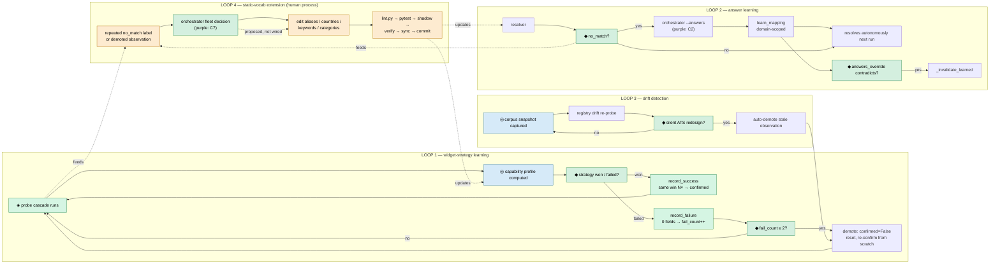

# Self-Adaptation Meta-Flow Graph

The flow that builds and adapts the flow itself — probe-cascade learning,
answer learning, drift demotion, and the human/orchestrator loops that extend
static vocabulary. Source in `apply/common/observations.py`, `resolve.py`,
`corpus.py`, `registry_cli.py`, and the SKILL.md change protocol.

Render with: `npx -y @mermaid-js/mermaid-cli -i META_FLOW_GRAPH.md -o META_FLOW_GRAPH.png`

Legend: ◈ loop · ◆ decision · ◎ observation · purple = orchestrator contract

